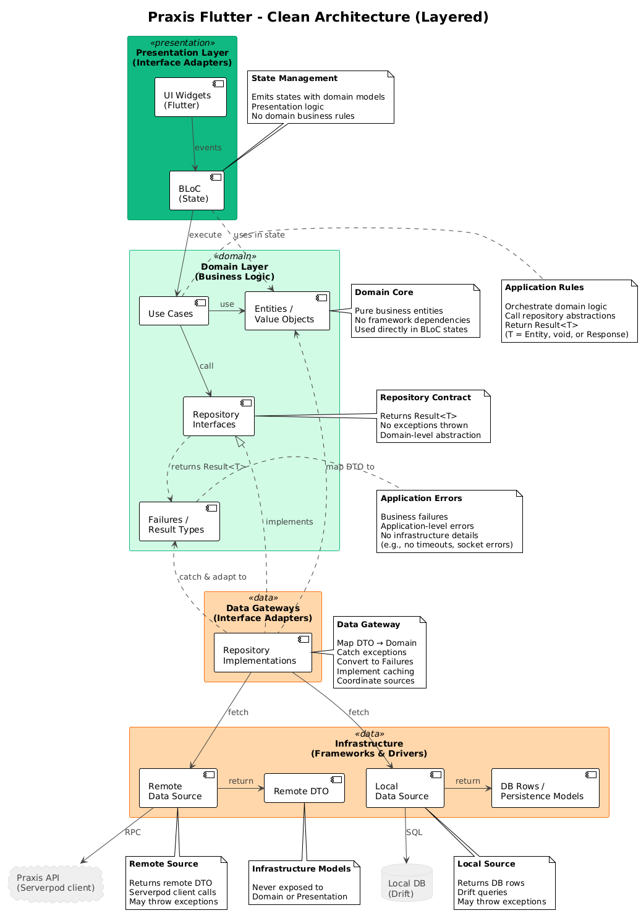

# Praxis Flutter

[](https://flutter.dev)
[](https://dart.dev)

Cross-platform mobile and web application for the **Praxis** educational platform – an interactive learning system for programming courses.

**[Quick Start](#quick-start)** • **[Architecture](#architecture)** • **[Development](#development)**

---

**Languages:** [English](#) • [Русский](docs/ru/README.md)

## Overview

Praxis Flutter is the client application for the Praxis educational platform. It provides:

- **Course browsing and enrollment** – discover and enroll in programming courses
- **Interactive lessons** – study materials with various task types
- **Task completion** – multiple choice, code completion, matching, text input
- **AI assistance** – get hints and explanations when stuck
- **Progress tracking** – monitor your learning statistics and achievements
- **Gamification** – earn coins, unlock achievements, maintain daily streaks
- **User profile** – manage your account and view statistics

## Architecture

The app follows **Clean Architecture** with **BLoC** pattern for state management:



*[View PlantUML source](docs/diagrams/uml/architecture-overview.puml)*

```
lib/
├── features/         # Feature modules (UI + BLoC)
│   ├── auth/         # Authentication
│   ├── courses/      # Course browsing
│   ├── lessons/      # Lesson viewing
│   ├── tasks/        # Task completion
│   └── profile/      # User profile
├── domain/           # Business logic layer
│   ├── models/       # Domain models
│   ├── repositories/ # Repository interfaces
│   └── usecases/     # Business use cases
├── data/             # Data layer
│   ├── entities/     # Data entities
│   ├── datasources/  # Remote/Local data sources
│   ├── repositories/ # Repository implementations
│   └── mappers/      # Entity ↔ Model mappers
└── core/             # Shared utilities
    ├── theme/        # App theming
    ├── router/       # Navigation
    ├── config/       # Configuration
    └── widgets/      # Reusable widgets
```

### Key Principles

- **Features** contain UI and BLoC for specific functionality
- **Domain** layer is framework-independent business logic
- **Data** layer handles data access via Serverpod client
- **Core** provides shared utilities and configuration

## Prerequisites

- [FVM](https://fvm.app) (Flutter Version Management)
- Flutter 3.38+ / Dart 3.10+ (managed via FVM)
- Running [praxis_server](../praxis_server/) instance

## Quick Start

### 1. Install Dependencies

```bash
cd praxis_flutter

# Install dependencies
fvm flutter pub get
```

### 2. Configure Environment

Create `.env` file (copy from `.env.example`):

```env
# Serverpod Configuration
SERVERPOD_HOST=http://localhost:8080

# Database Configuration
DB_PATH=codium.db

# Gemini API Configuration (optional for AI features)
GEMINI_API_KEY=your_gemini_api_key_here

# Proxy Configuration (optional)
PROXY_HOST=your_proxy_host
PROXY_PORT=8080
PROXY_USER=your_proxy_username
PROXY_PASS=your_proxy_password
```

### 3. Run the App

```bash
# Run on connected device/emulator
fvm flutter run

# Run on specific platform
fvm flutter run -d chrome        # Web
fvm flutter run -d macos          # macOS
fvm flutter run -d ios            # iOS (requires macOS)
fvm flutter run -d android        # Android
```

## Development

### Code Generation

The app uses code generation for various purposes:

```bash
# Generate Serverpod client (after server protocol changes)
# This is done automatically by the server

# Generate localization files
fvm flutter gen-l10n

# Generate all (build_runner)
fvm flutter pub run build_runner build --delete-conflicting-outputs
```

### Running Tests

```bash
# Run all tests
fvm flutter test

# Run specific test file
fvm flutter test test/features/auth/auth_bloc_test.dart

# Run with coverage
fvm flutter test --coverage
```

### Code Quality

```bash
# Format code
fvm dart format .

# Analyze code
fvm flutter analyze

# Fix common issues
fvm dart fix --apply
```

### Development Workflow

1. Make changes to features/domain/data
2. Run code generation if needed
3. Add tests for new functionality
4. Run `fvm dart format .` and `fvm flutter analyze`
5. Commit changes with ticket prefix

## Project Structure

### Features

Each feature is self-contained with its own UI and BLoC:

- `auth/` – Sign in, sign up, password reset
- `courses/` – Course list, details, enrollment
- `lessons/` – Lesson content, navigation
- `tasks/` – Task types, answer submission
- `profile/` – User profile, statistics

### Domain Layer

Framework-independent business logic:

- `models/` – Domain entities (Course, Lesson, Task, User)
- `repositories/` – Abstract interfaces for data access
- `usecases/` – Business operations (GetCourses, CompleteLesson)

### Data Layer

Data access implementation:

- `datasources/` – Remote (Serverpod) and Local (Drift) data sources
- `repositories/` – Repository implementations
- `entities/` – Data transfer objects
- `mappers/` – Convert between entities and domain models

## Configuration

### App Configuration

Edit `lib/core/config/app_config.dart` for app-wide settings.

## Documentation

- **Platform:** [Platform README](../.github/README.md)
- **Backend:** [praxis_server/README.md](../praxis_server/README.md)
- **AI Guidelines:** [AGENTS.md](../AGENTS.md)

### External Resources

- [Flutter Documentation](https://docs.flutter.dev)
- [BLoC Pattern](https://bloclibrary.dev)
- [Effective Dart](https://dart.dev/guides/language/effective-dart)

## Development Guidelines

### Commit Message Format

```
[TICKET-ID] Brief description in Russian or English

Examples:
[CDM-23] Поправил детальную страницу
[CDM-18] Added background images
```

### Code Style

- Follow [Effective Dart](https://dart.dev/guides/language/effective-dart) guidelines
- Use `fvm dart format .` before committing
- Ensure `fvm flutter analyze` passes with no issues

## License

This is an educational project developed for university purposes.
