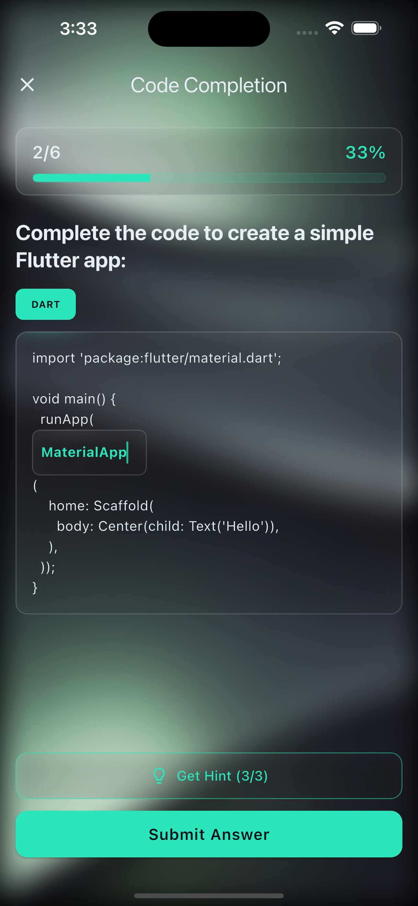
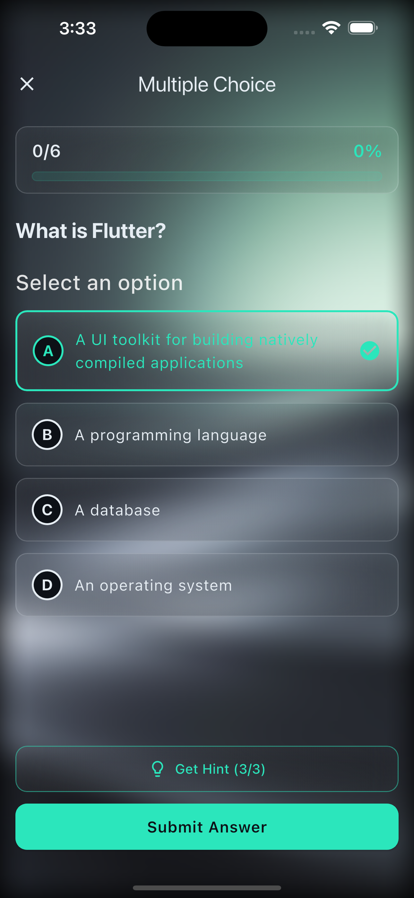
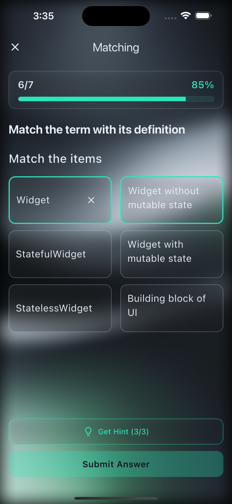

# Praxis Flutter

[](https://flutter.dev)
[](https://dart.dev)

Кроссплатформенное мобильное и веб-приложение для образовательной платформы **Praxis** – интерактивной системы обучения программированию.

**[Быстрый старт](#быстрый-старт)** • **[Архитектура](#архитектура)** • **[Разработка](#разработка)**

---

**Языки:** [English](../../README.md) • [Русский](#)

## Скриншоты

<p align="center">
  
  
  
</p>

## Обзор

Praxis Flutter – это клиентское приложение для образовательной платформы Praxis. Оно предоставляет:

- **Просмотр и запись на курсы** – поиск и запись на курсы программирования
- **Интерактивные уроки** – изучение материалов с различными типами заданий
- **Выполнение заданий** – множественный выбор, дополнение кода, сопоставление, текстовый ввод
- **AI-ассистент** – получение подсказок и объяснений при затруднениях
- **Отслеживание прогресса** – мониторинг статистики обучения и достижений
- **Геймификация** – заработок монет, разблокировка достижений, поддержание ежедневных серий
- **Профиль пользователя** – управление аккаунтом и просмотр статистики

## Архитектура

Приложение следует **Clean Architecture** с паттерном **BLoC** для управления состоянием:


*[Посмотреть PlantUML-исходник](../diagrams/uml/architecture-overview.puml)*

```
lib/
├── features/         # Модули функций (UI + BLoC)
│   ├── auth/         # Аутентификация
│   ├── courses/      # Просмотр курсов
│   ├── lessons/      # Просмотр уроков
│   ├── tasks/        # Выполнение заданий
│   └── profile/      # Профиль пользователя
├── domain/           # Слой бизнес-логики
│   ├── models/       # Доменные модели
│   ├── repositories/ # Интерфейсы репозиториев
│   └── usecases/     # Бизнес-операции
├── data/             # Слой данных
│   ├── entities/     # Сущности данных
│   ├── datasources/  # Удалённые/Локальные источники данных
│   ├── repositories/ # Реализации репозиториев
│   └── mappers/      # Преобразователи Entity ↔ Model
└── core/             # Общие утилиты
    ├── theme/        # Темы приложения
    ├── router/       # Навигация
    ├── config/       # Конфигурация
    └── widgets/      # Переиспользуемые виджеты
```

### Ключевые принципы

- **Features** содержат UI и BLoC для конкретной функциональности
- **Domain** слой – независимая от фреймворка бизнес-логика
- **Data** слой обрабатывает доступ к данным через Serverpod-клиент
- **Core** предоставляет общие утилиты и конфигурацию

## Требования

- [FVM](https://fvm.app) (Flutter Version Management)
- Flutter 3.38+ / Dart 3.10+ (управляется через FVM)
- Запущенный экземпляр [praxis_server](../../../praxis_server/)

## Быстрый старт

### 1. Установить зависимости

```bash
cd praxis_flutter

# Установить зависимости
fvm flutter pub get
```

### 2. Настроить окружение

Создайте файл `.env` (скопируйте из `.env.example`):

```env
# Конфигурация Serverpod
SERVERPOD_HOST=http://localhost:8080

# Конфигурация базы данных
DB_PATH=praxis.db

# Конфигурация Gemini API (опционально для AI-функций)
GEMINI_API_KEY=your_gemini_api_key_here

# Конфигурация прокси (опционально)
PROXY_HOST=your_proxy_host
PROXY_PORT=8080
PROXY_USER=your_proxy_username
PROXY_PASS=your_proxy_password
```

### 3. Запустить приложение

```bash
# Запустить на подключённом устройстве/эмуляторе
fvm flutter run

# Запустить на конкретной платформе
fvm flutter run -d chrome        # Web
fvm flutter run -d macos          # macOS
fvm flutter run -d ios            # iOS (требуется macOS)
fvm flutter run -d android        # Android
```

## Разработка

### Генерация кода

Приложение использует генерацию кода для различных целей:

```bash
# Сгенерировать Serverpod-клиент (после изменений протокола сервера)
# Это делается автоматически сервером

# Сгенерировать файлы локализации
fvm flutter gen-l10n

# Сгенерировать всё (build_runner)
fvm flutter pub run build_runner build --delete-conflicting-outputs
```

### Запуск тестов

```bash
# Запустить все тесты
fvm flutter test

# Запустить конкретный тестовый файл
fvm flutter test test/features/auth/auth_bloc_test.dart

# Запустить с покрытием
fvm flutter test --coverage
```

### Качество кода

```bash
# Форматировать код
fvm dart format .

# Анализировать код
fvm flutter analyze

# Исправить распространённые проблемы
fvm dart fix --apply
```

### Процесс разработки

1. Внесите изменения в features/domain/data
2. Запустите генерацию кода при необходимости
3. Добавьте тесты для новой функциональности
4. Запустите `fvm dart format .` и `fvm flutter analyze`
5. Закоммитьте изменения с префиксом тикета

## Структура проекта

### Features

Каждая функция самодостаточна со своим UI и BLoC:

- `auth/` – Вход, регистрация, сброс пароля
- `courses/` – Список курсов, детали, запись
- `lessons/` – Содержимое урока, навигация
- `tasks/` – Типы заданий, отправка ответов
- `profile/` – Профиль пользователя, статистика

### Domain Layer

Независимая от фреймворка бизнес-логика:

- `models/` – Доменные сущности (Course, Lesson, Task, User)
- `repositories/` – Абстрактные интерфейсы для доступа к данным
- `usecases/` – Бизнес-операции (GetCourses, CompleteLesson)

### Data Layer

Реализация доступа к данным:

- `datasources/` – Удалённые (Serverpod) и локальные (Drift) источники данных
- `repositories/` – Реализации репозиториев
- `entities/` – Объекты передачи данных
- `mappers/` – Преобразование между entities и domain models

## Конфигурация

### Конфигурация приложения

Отредактируйте `lib/core/config/app_config.dart` для настроек всего приложения.

## Документация

- **Платформа:** [Platform README](../../../.github/README.md)
- **Backend:** [praxis_server/README.md](../../../praxis_server/README.md)
- **Рекомендации для AI:** [AGENTS.md](../../../AGENTS.md)

### Внешние ресурсы

- [Документация Flutter](https://docs.flutter.dev)
- [Паттерн BLoC](https://bloclibrary.dev)
- [Effective Dart](https://dart.dev/guides/language/effective-dart)

## Рекомендации по разработке

### Формат сообщений коммитов

```
[TICKET-ID] Краткое описание на русском или английском

Примеры:
[CDM-23] Поправил детальную страницу
[CDM-18] Added background images
```

### Стиль кода

- Следуйте рекомендациям [Effective Dart](https://dart.dev/guides/language/effective-dart)
- Используйте `fvm dart format .` перед коммитом
- Убедитесь, что `fvm flutter analyze` проходит без проблем

## Лицензия

Это образовательный проект, разработанный для университетских целей.
